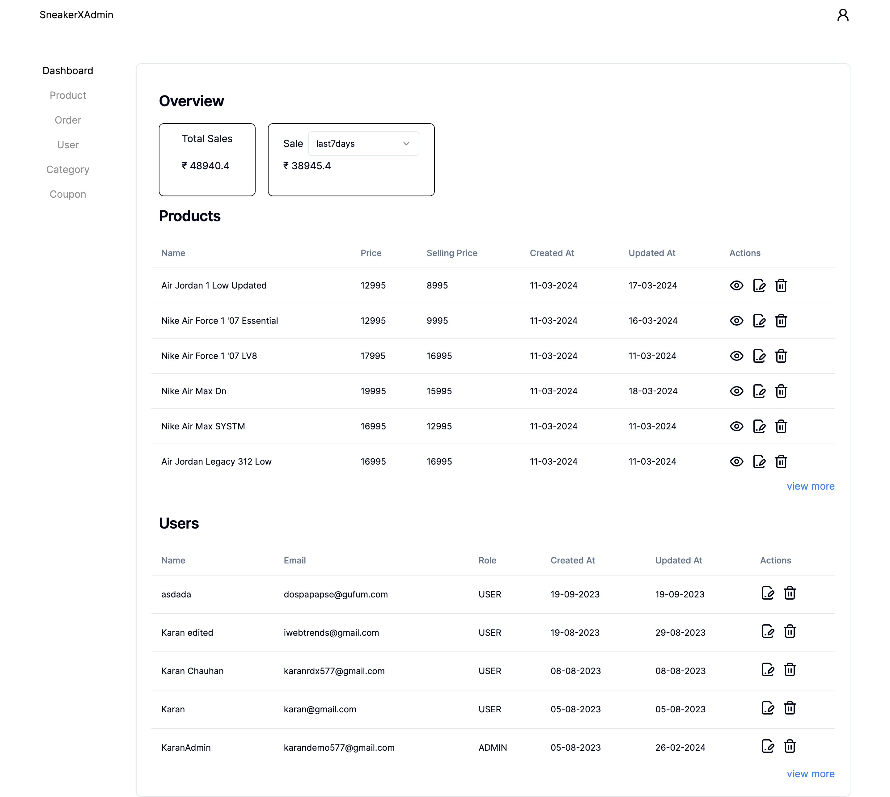
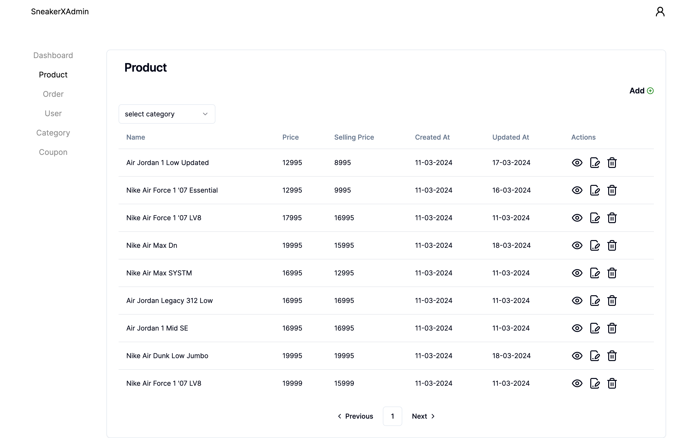
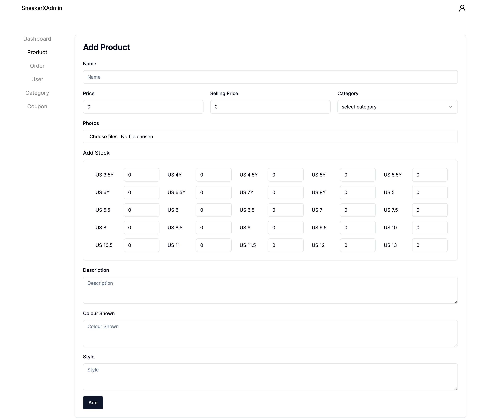
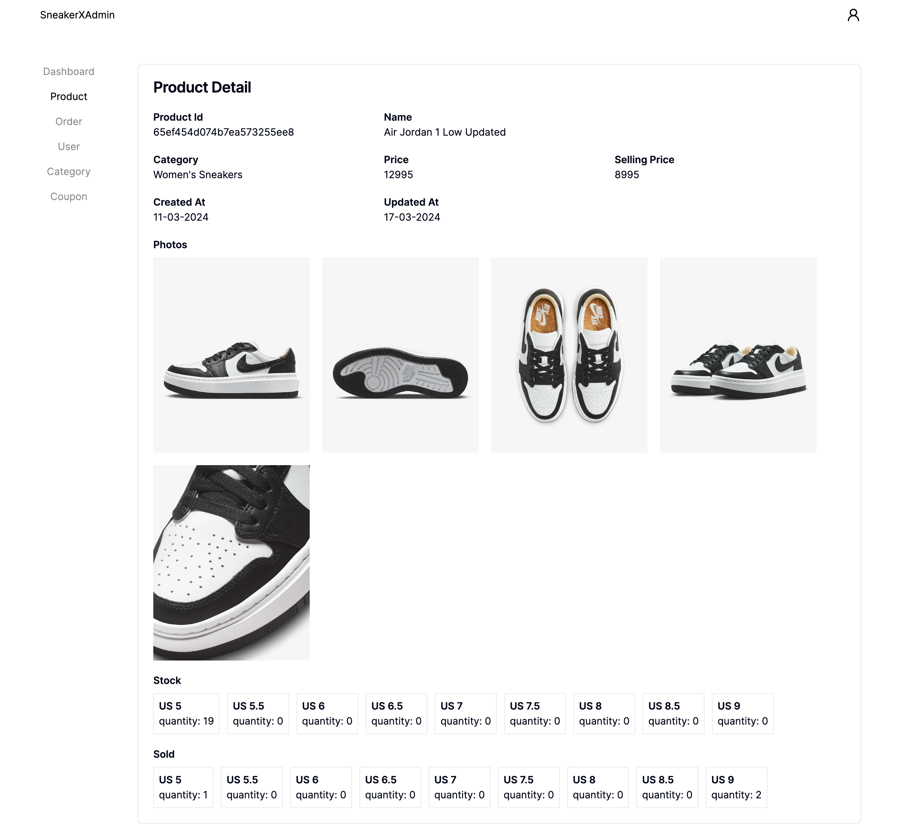
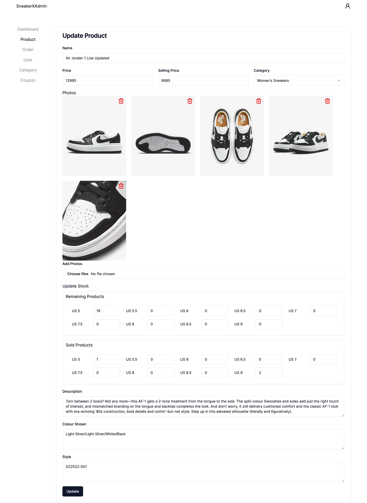
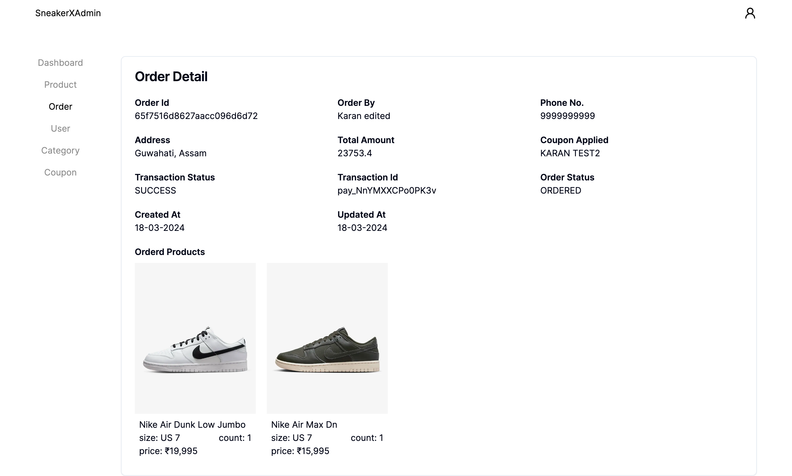
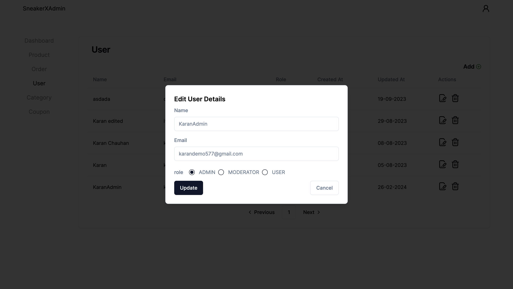

# Sneakerx-Admin-Dashboard

This is the Admin dashboard for Sneakerx. It is build using Nextjs 14. Tanstack Query v5 (React Query) is used for data fetching, caching, etc. Zustand is used for state management.

### Time taken - 10 days

### [Live Link](https://sneakerx-admin.vercel.app)

### This is the admin dashboard repository. You can find the frontend of this project [here](https://github.com/karanch577/Sneakerx-frontend) and backend [here](https://github.com/karanch577/Sneakerx-backend).  A sample.env file has been added.

## Demo Users

### User: 
email - karandemo577@gmail.com  
password - 543219

## Technologies
This project was built using the following technologies:

- Next.js 14 (App Router)
- Zustand
- Tanstack Query (React query) v5
- Axios
- Shadcn/ui
- Tailwind CSS
- Typescript

## Features
The application comes with the following features:

- Add, edit & remove product, category, coupon
- Manage orders, edit orders
- Browse products by category
- Get Total Sales data - by weekly, monthly, yearly

## Screenshots

#### Home page

#### Products

#### Add product

#### Product Details

#### Update Product

#### Order details

#### Edit User Details

The end